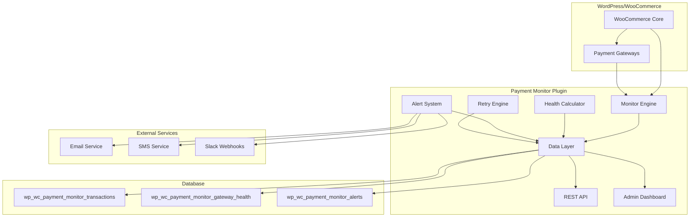

# Design Document: Payment Monitor

## Overview

The WooCommerce Payment Failure Monitor is a WordPress plugin that provides real-time monitoring, alerting, and recovery capabilities for payment gateway failures. The system operates as a passive monitoring layer that hooks into WooCommerce's payment processing pipeline without interfering with normal checkout operations.

The architecture follows a modular design with four core components:

1. **Monitor Engine** - Captures and logs all payment transactions
2. **Health Calculator** - Computes success rates and gateway performance metrics
3. **Alert System** - Sends notifications when thresholds are breached
4. **Retry Engine** - Automatically attempts to recover failed payments

The system is designed to handle high-volume stores (1000+ transactions/hour) while maintaining minimal performance overhead (<100ms per transaction).

## Architecture



The plugin integrates with WooCommerce through action hooks, capturing payment events without modifying core functionality. Data flows unidirectionally from WooCommerce events through the monitoring pipeline to storage and presentation layers.

## Components and Interfaces

### Monitor Engine

**Responsibility:** Capture all payment transactions and log them for analysis.

**Key Interfaces:**

- `WC_Payment_Monitor_Logger::log_success($order_id)` - Records successful payments
- `WC_Payment_Monitor_Logger::log_failure($order_id)` - Records failed payments with error details
- `WC_Payment_Monitor_Logger::save_transaction($data)` - Persists transaction data to database

**Integration Points:**

- Hooks: `woocommerce_payment_complete`, `woocommerce_order_status_failed`, `woocommerce_order_status_pending`
- Data Sources: WooCommerce order objects, payment gateway responses
- Output: Structured transaction records in database

### Health Calculator

**Responsibility:** Compute gateway performance metrics across multiple time periods.

**Key Interfaces:**

- `WC_Payment_Monitor_Health::calculate_health($gateway_id)` - Computes metrics for all time periods
- `WC_Payment_Monitor_Health::get_health_status($gateway_id, $period)` - Retrieves current health status
- `WC_Payment_Monitor_Health::calculate_period_health($gateway_id, $period, $seconds)` - Computes metrics for specific period

**Calculation Logic:**

- Success Rate = (Successful Transactions / Total Transactions) × 100
- Time Periods: 1 hour (3600s), 24 hours (86400s), 7 days (604800s)
- Update Frequency: Every 5 minutes via WordPress cron
- Historical Data: Maintains 30 days of health snapshots

### Alert System

**Responsibility:** Monitor health metrics and send notifications when thresholds are breached.

**Key Interfaces:**

- `WC_Payment_Monitor_Alerts::check_and_send($gateway_id, $health_data)` - Evaluates and triggers alerts
- `WC_Payment_Monitor_Alerts::trigger_alert($alert_data)` - Sends notifications through configured channels
- `WC_Payment_Monitor_Alerts::is_rate_limited($alert_data)` - Prevents alert fatigue

**Alert Severity Logic:**

- Critical: Success rate < 70%
- Warning: Success rate < 85%
- Info: Success rate < 95%

**Rate Limiting:** Maximum one alert per type per gateway per hour.

### Retry Engine

**Responsibility:** Automatically attempt to recover failed payments using stored payment methods.

**Key Interfaces:**

- `WC_Payment_Monitor_Retry::schedule_retry($transaction_id)` - Schedules retry attempts
- `WC_Payment_Monitor_Retry::attempt_retry($transaction_id)` - Executes payment retry
- `WC_Payment_Monitor_Retry::send_retry_success_email($order)` - Notifies customers of recovery

**Retry Schedule:** 1 hour, 6 hours, 24 hours (configurable)
**Maximum Attempts:** 3 per transaction
**Success Notification:** Email sent to customer when retry succeeds

### Data Layer

**Responsibility:** Provide consistent data access and storage abstraction.

**Database Schema:**

**Transactions Table:**

```sql
wp_wc_payment_monitor_transactions (
    id BIGINT PRIMARY KEY,
    order_id BIGINT NOT NULL,
    gateway_id VARCHAR(50) NOT NULL,
    transaction_id VARCHAR(100),
    amount DECIMAL(10,2) NOT NULL,
    currency VARCHAR(3) NOT NULL,
    status ENUM('success', 'failed', 'pending', 'retry'),
    failure_reason TEXT,
    failure_code VARCHAR(50),
    retry_count TINYINT DEFAULT 0,
    customer_email VARCHAR(100),
    customer_ip VARCHAR(45),
    created_at DATETIME NOT NULL,
    updated_at DATETIME
)
```

**Gateway Health Table:**

```sql
wp_wc_payment_monitor_gateway_health (
    id BIGINT PRIMARY KEY,
    gateway_id VARCHAR(50) NOT NULL,
    period ENUM('1hour', '24hour', '7day'),
    total_transactions INT DEFAULT 0,
    successful_transactions INT DEFAULT 0,
    failed_transactions INT DEFAULT 0,
    success_rate DECIMAL(5,2) DEFAULT 0.00,
    avg_response_time INT,
    last_failure_at DATETIME,
    calculated_at DATETIME NOT NULL
)
```

**Alerts Table:**

```sql
wp_wc_payment_monitor_alerts (
    id BIGINT PRIMARY KEY,
    alert_type ENUM('gateway_down', 'low_success_rate', 'high_failure_count', 'gateway_error'),
    gateway_id VARCHAR(50) NOT NULL,
    severity ENUM('info', 'warning', 'critical'),
    message TEXT NOT NULL,
    metadata TEXT,
    is_resolved TINYINT(1) DEFAULT 0,
    resolved_at DATETIME,
    notified_at DATETIME,
    created_at DATETIME NOT NULL
)
```

## Data Models

### Transaction Model

```php
class WC_Payment_Monitor_Transaction {
    public int $id;
    public int $order_id;
    public string $gateway_id;
    public ?string $transaction_id;
    public float $amount;
    public string $currency;
    public string $status; // success, failed, pending, retry
    public ?string $failure_reason;
    public ?string $failure_code;
    public int $retry_count;
    public ?string $customer_email;
    public ?string $customer_ip;
    public DateTime $created_at;
    public ?DateTime $updated_at;
}
```

### Gateway Health Model

```php
class WC_Payment_Monitor_Gateway_Health {
    public int $id;
    public string $gateway_id;
    public string $period; // 1hour, 24hour, 7day
    public int $total_transactions;
    public int $successful_transactions;
    public int $failed_transactions;
    public float $success_rate;
    public ?int $avg_response_time;
    public ?DateTime $last_failure_at;
    public DateTime $calculated_at;
}
```

### Alert Model

```php
class WC_Payment_Monitor_Alert {
    public int $id;
    public string $alert_type;
    public string $gateway_id;
    public string $severity; // info, warning, critical
    public string $message;
    public ?array $metadata;
    public bool $is_resolved;
    public ?DateTime $resolved_at;
    public ?DateTime $notified_at;
    public DateTime $created_at;
}
```

### Configuration Model

```php
class WC_Payment_Monitor_Settings {
    public array $enabled_gateways;
    public string $alert_email;
    public int $alert_threshold; // percentage
    public int $monitoring_interval; // seconds
    public bool $enable_auto_retry;
    public array $retry_schedule; // seconds array
    public ?string $alert_phone;
    public ?string $slack_webhook;
}
```

## Correctness Properties

_A property is a characteristic or behavior that should hold true across all valid executions of a system—essentially, a formal statement about what the system should do. Properties serve as the bridge between human-readable specifications and machine-verifiable correctness guarantees._

### Property 1: Transaction Logging Completeness

_For any_ payment attempt through WooCommerce, the Payment_Monitor should log a transaction record containing status, amount, gateway information, and appropriate diagnostic data (transaction ID for success, failure reason for failures).
**Validates: Requirements 1.1, 1.2, 1.3**

### Property 2: Checkout Process Non-Interference

_For any_ WooCommerce checkout process, enabling the Payment_Monitor should not change the checkout completion time or success rate compared to the baseline without monitoring.
**Validates: Requirements 1.4**

### Property 3: Health Calculation Accuracy

_For any_ set of transaction data and time period (1hour, 24hour, 7day), the calculated success rate should equal (successful transactions / total transactions) × 100, and historical health data should be stored for retrieval.
**Validates: Requirements 2.1, 2.4**

### Property 4: Health Update Scheduling

_For any_ monitoring interval configuration, the health calculation function should be invoked at the specified intervals via WordPress cron.
**Validates: Requirements 2.2**

### Property 5: Gateway Status Threshold Detection

_For any_ gateway with a success rate below the configured threshold, the gateway should be marked as degraded, and when the success rate recovers above the threshold, the gateway should be marked as healthy.
**Validates: Requirements 2.3**

### Property 6: Empty Data Handling

_For any_ time period with zero transactions, health calculations should return zero values for all metrics rather than errors or undefined states.
**Validates: Requirements 2.5**

### Property 7: Alert Triggering and Severity

_For any_ gateway success rate that drops below the configured threshold, an alert should be triggered with severity determined by the success rate (critical < 70%, warning < 85%, info < 95%), and when conditions improve, alerts should be marked as resolved.
**Validates: Requirements 3.1, 3.4, 3.5**

### Property 8: Alert Rate Limiting

_For any_ alert type and gateway combination, only one alert should be sent within the rate limiting window (default 1 hour), preventing duplicate notifications.
**Validates: Requirements 3.2**

### Property 9: Premium Feature Availability

_For any_ premium feature (SMS, Slack notifications), the feature should be available when premium license is active and unavailable when license is inactive or expired.
**Validates: Requirements 3.3, 8.5**

### Property 10: Retry Scheduling and Limiting

_For any_ failed payment with auto-retry enabled, retry attempts should be scheduled at configured intervals, limited to maximum 3 attempts per transaction, and retry success rates should be tracked for monitoring.
**Validates: Requirements 4.1, 4.2, 4.5**

### Property 11: Retry Payment Method Consistency

_For any_ retry attempt, the payment method used should match the payment method from the original failed transaction.
**Validates: Requirements 4.3**

### Property 12: Successful Retry Handling

_For any_ successful retry attempt, the customer should be notified via email and the order status should be updated to reflect the successful payment.
**Validates: Requirements 4.4**

### Property 13: Dashboard Data Display

_For any_ gateway health data, the Admin_Dashboard should display the correct health status with appropriate color coding, show recent failed transactions with failure reasons, and provide drill-down navigation to detailed views.
**Validates: Requirements 5.1, 5.2, 5.5**

### Property 14: Dashboard Auto-Refresh

_For any_ dashboard session, data should be refreshed automatically every 30 seconds without user intervention.
**Validates: Requirements 5.3**

### Property 15: Database Storage Structure

_For any_ transaction data, it should be stored in the custom database tables with the correct schema structure and indexing for optimal query performance.
**Validates: Requirements 6.1**

### Property 16: Credential Encryption

_For any_ payment gateway credentials, they should be encrypted before storage and successfully decryptable when retrieved, using WordPress encryption functions.
**Validates: Requirements 6.2**

### Property 17: Sensitive Data Exclusion

_For any_ payment transaction, sensitive payment information (card numbers, CVV codes) should never be stored in the plugin's database tables.
**Validates: Requirements 6.3**

### Property 18: SQL Injection Prevention

_For any_ database query, prepared statements should be used to prevent SQL injection attacks.
**Validates: Requirements 6.4**

### Property 19: Access Control Enforcement

_For any_ admin function, proper WordPress capability checks should be enforced before allowing access.
**Validates: Requirements 6.5**

### Property 20: API Response Consistency

_For any_ REST API endpoint (gateway health, transaction history), responses should be in valid JSON format with consistent error handling and proper authentication requirements.
**Validates: Requirements 7.1, 7.2, 7.3, 7.5**

### Property 21: API Pagination

_For any_ API request that could return large datasets, results should be paginated with a maximum of 200 records per request.
**Validates: Requirements 7.4**

### Property 22: Configuration Management

_For any_ settings configuration, values should be validated, sanitized before storage in WordPress options, and gateway monitoring should be toggleable per gateway.
**Validates: Requirements 8.1, 8.2, 8.4**

### Property 23: Retry Configuration Validation

_For any_ retry settings configuration, invalid retry intervals or maximum attempts should be rejected with appropriate error messages.
**Validates: Requirements 8.3**

## Error Handling

The system implements comprehensive error handling across all components:

**Transaction Logging Errors:**

- Database connection failures: Log to WordPress error log, continue operation
- Invalid order data: Skip logging, record error for debugging
- Gateway API timeouts: Record as failed transaction with timeout reason

**Health Calculation Errors:**

- Division by zero: Return 0% success rate for periods with no transactions
- Database query failures: Use cached values, log error for investigation
- Invalid time periods: Default to 24-hour period, log warning

**Alert System Errors:**

- Email delivery failures: Retry once, then log failure for manual review
- SMS/Slack API failures: Fall back to email alerts, log service errors
- Rate limiting storage errors: Allow alert to proceed, log storage issue

**Retry Engine Errors:**

- Payment gateway API failures: Record retry failure, schedule next attempt
- Order not found: Cancel retry attempts, log orphaned transaction
- Maximum retries exceeded: Mark transaction as permanently failed

**API Errors:**

- Authentication failures: Return 401 with clear error message
- Invalid parameters: Return 400 with parameter validation details
- Database errors: Return 500 with generic error message (log details internally)

**Configuration Errors:**

- Invalid settings: Revert to defaults, show admin notice
- License validation failures: Disable premium features, notify admin
- Database schema errors: Attempt auto-repair, log critical error

## Testing Strategy

The testing strategy employs a dual approach combining unit tests for specific scenarios and property-based tests for comprehensive coverage:

**Unit Testing:**

- Specific examples demonstrating correct behavior
- Edge cases and error conditions (empty datasets, invalid inputs)
- Integration points between components
- WordPress hook integration and callback execution
- Database schema creation and migration

**Property-Based Testing:**

- Universal properties verified across randomized inputs
- Minimum 100 iterations per property test for statistical confidence
- Each property test references its corresponding design document property
- Tag format: **Feature: payment-monitor, Property {number}: {property_text}**

**Testing Framework:**

- PHPUnit for unit tests and property-based testing
- WordPress testing framework for integration tests
- Mock payment gateways for controlled testing scenarios
- Database fixtures for consistent test data

**Test Configuration:**

- Property tests run with 100+ iterations to ensure statistical validity
- Unit tests focus on specific examples and boundary conditions
- Integration tests verify component interactions and WordPress compatibility
- Performance tests validate transaction processing overhead remains <100ms

**Coverage Requirements:**

- All public methods must have unit test coverage
- All correctness properties must have corresponding property-based tests
- Critical paths (transaction logging, health calculation, alerting) require both unit and property tests
- Error handling paths must be tested with appropriate failure scenarios
